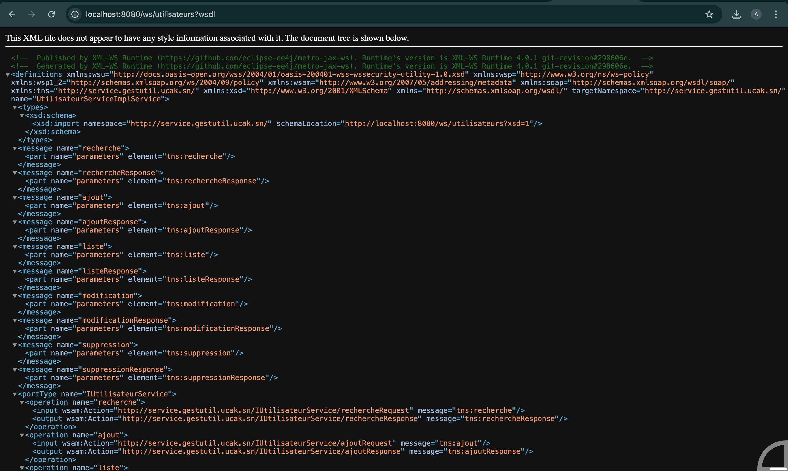
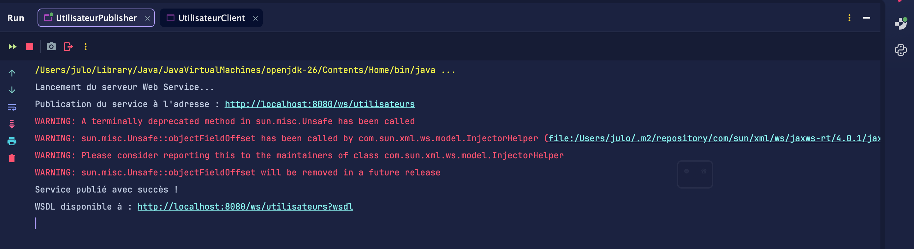
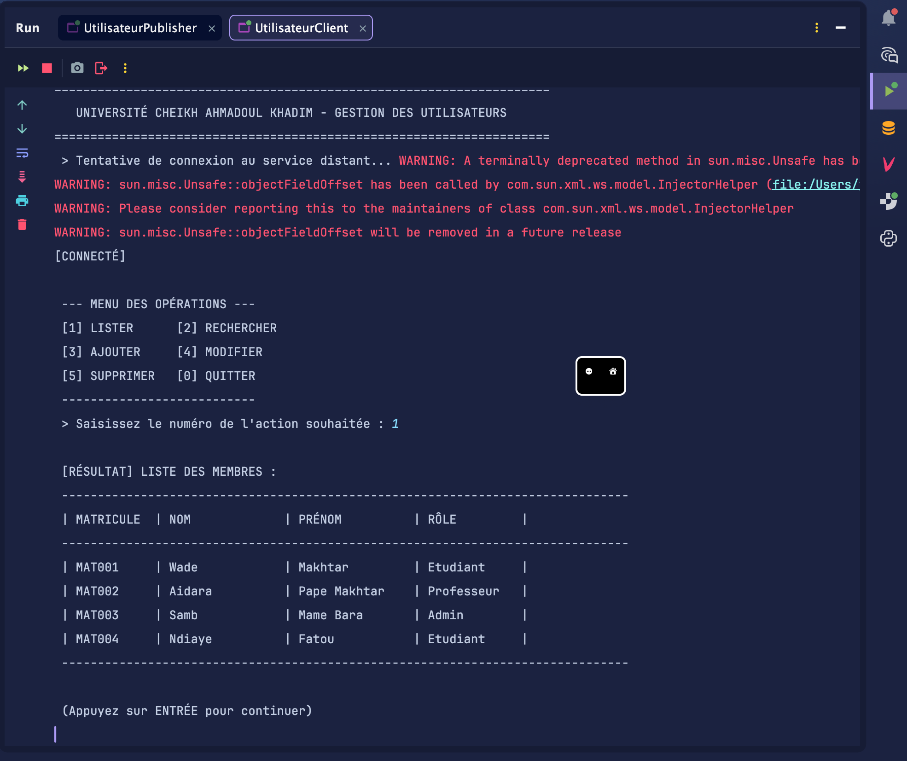

# PROJET #03 : WEB SERVICES JAVA (SANS SPRING BOOT)
## Système de Gestion des Utilisateurs - Documentation Technique

---

### 1. Description des Opérations du Contrat

Le Web Service expose une interface CRUD via le contrat `IUtilisateurService`. Les opérations sont définies pour une consommation standardisée via le protocole SOAP.

| Opération | Méthode XML | Description | Paramètres d'entrée | Type de retour |
| :--- | :--- | :--- | :--- | :--- |
| **Ajout** | `ajout` | Création d'un utilisateur avec matricule généré | Objet `Utilisateur` | `Utilisateur` (complet) |
| **Liste** | `liste` | Récupération de l'ensemble des membres | Aucun | `List<Utilisateur>` |
| **Recherche** | `recherche` | Recherche d'un profil par matricule unique | `matricule` (String) | `Utilisateur` |
| **Modification**| `modification`| Mise à jour des informations d'un membre | Objet `Utilisateur` | `boolean` (Succès) |
| **Suppression** | `suppression` | Retrait définitif d'un membre du système | `matricule` (String) | `boolean` (Succès) |

---

### 2. Architecture et Environnement Technique

#### Pile Technologique
*   **Langage :** Java 17
*   **Framework :** JAX-WS (Jakarta XML Web Services)
*   **Data Binding :** JAXB (Jakarta XML Binding)
*   **Build Tool :** Maven

#### Logique Métier Avancée
1.  **Génération de Matricule :** Le serveur assure l'unicité des identifiants en générant automatiquement des matricules au format institutionnel (ex: `UCAK001`).
2.  **Contrôle d'Intégrité :** Le client intègre une validation préventive des rôles pour garantir que seuls les profils `Etudiant`, `Professeur` ou `Admin` sont transmis.

---

### 3. Organisation du Projet (Packages)

*   `sn.ucak.gestutil.model` : Contient le POJO `Utilisateur` avec les annotations XML nécessaires.
*   `sn.ucak.gestutil.service` : Définit l'interface du service (Contrat) et son implémentation.
*   `sn.ucak.gestutil.server` : Gère la publication de l'Endpoint SOAP.
*   `sn.ucak.gestutil.client` : Interface console permettant de consommer le service distant.

---

### 4. Guide d'Exécution et Validation

#### Publication du Service
1.  Exécuter la classe `UtilisateurPublisher`.
2.  Le serveur sera accessible à l'adresse suivante : `http://localhost:8080/ws/utilisateurs`.
3.  Le contrat WSDL est consultable via : `http://localhost:8080/ws/utilisateurs?wsdl`.

#### Utilisation du Client
1.  Exécuter la classe `UtilisateurClient`.
2.  Utiliser le menu numérique (0-5) pour interagir avec le serveur.
3.  Les retours (Succès/Erreur) sont affichés directement dans la console client.

---

### 5. Captures d'écran des tests

Afin de valider le bon fonctionnement du système, les tests suivants ont été réalisés :

*   **Validation du Contrat (WSDL) :** Consultation du flux XML généré par le serveur.
    

*   **Lancement du Serveur :** Confirmation de la publication du service sur le port 8080.
    

*   **Opération Liste :** Affichage de la liste des membres via le client console.
    

---

### 6. Étude Comparative

L'analyse comparative entre l'ancienne architecture RMI et la nouvelle architecture Web Service SOAP est disponible dans le document séparé : **[COMPARAISON.md](COMPARAISON.md)**.

---
*Auteurs : Pape Makhtar Aidara et Makhtar WADE — Université Cheikh Ahmadoul Khadim (UCAK) — 2026*
